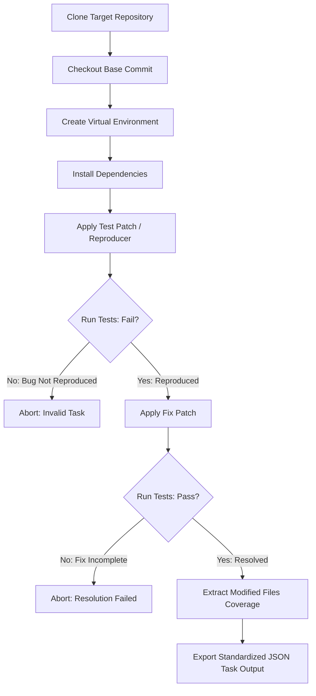
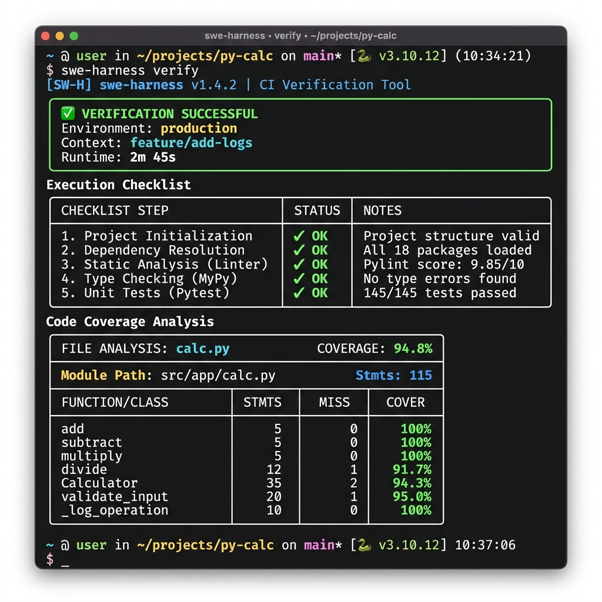

# SWE Task Harness
### Repository Verification Framework for LLM Software Engineering Evaluation

[](https://www.python.org/)
[](https://github.com/researchplughub/swe-task-harness/actions)
[](https://github.com/researchplughub/swe-task-harness)
[](https://www.docker.com/)
[](LICENSE)

A Python library and command-line interface for automating repository state replication, isolated virtual environment provisioning, patch verification, and test coverage analysis.

This tool is designed for pipelines that verify coding tasks or reproduce issue reports from Git repository histories. It automates baseline checkouts, dependency resolution, reproducer validation, and post-fix testing inside isolated environments.

---

## Why this project?

Modern LLM software engineering benchmarks rely on reproducible repository execution. This project demonstrates a reproducible verification pipeline that automates repository preparation, environment isolation, patch validation, test execution, and coverage reporting.

---

## Verification Pipeline

The harness follows a structured sequence to determine whether a given issue report and corresponding fix are valid:



---

## CLI Interface

The CLI uses the `rich` library to print clear, structured checkpoint grids and coverage tables to the terminal during verification:



---

## Compatibility

* **Operating Systems**: Linux, macOS, Windows
* **Test Runners**: `pytest`, `unittest`
* **Dependency Files**: `requirements.txt`, `pyproject.toml`, `setup.py`

---

## Project Structure

```text
swe-task-harness/
├── .github/
│   └── workflows/
│       └── tests.yml          # GitHub Actions CI configuration
├── assets/
│   └── terminal_screenshot.png# CLI mockup asset
├── examples/
│   ├── verify_flask.py        # Example script for Flask repository
│   ├── verify_pytest.py       # Example script for Pytest repository
│   └── verify_requests.py     # Example script for Requests repository
├── harness/
│   ├── __init__.py            # Package entrypoint
│   ├── cli.py                 # CLI commands and display formatting
│   ├── env_utils.py           # Virtualenv management and package installation
│   ├── git_utils.py           # subprocess-based Git commands
│   ├── test_runner.py         # Pytest & Coverage execution wrapper
│   └── verifier.py            # Reproductive verification workflow
├── tests/
│   └── test_harness.py        # Mock repository test suite
├── Dockerfile                 # Sandboxed runtime build definition
├── docker-compose.yml         # Container run configuration
├── .dockerignore              # Docker copy exclusions
├── .gitignore                 # Git version exclusions
├── pyproject.toml             # Python build and dependency metadata
└── README.md                  # Project documentation
```

---

## Installation

To install `swe-task-harness` from source in development mode:

```bash
git clone https://github.com/researchplughub/swe-task-harness.git
cd swe-task-harness
pip install -e .[dev]
```

This registers the global command `swe-harness` in your active path.

---

## API Reference

### Verifier API

The core verification workflow can be executed programmatically via the `verify_task` function.

#### `verify_task(...)`

```python
from harness.verifier import verify_task, VerificationResult

result: VerificationResult = verify_task(
    repo_url="https://github.com/psf/requests.git",
    base_commit="d628d0859c25f17d3d0f0eb850e04771d9d48b11",
    test_patch="...",
    fix_patch="...",
    repo_dir="./workspace/repo",
    env_dir="./workspace/venv",
    test_targets=["tests/test_requests.py"]
)
```

**Parameters:**
* `repo_url` (str): Target Git repository clone URL.
* `base_commit` (str): Git commit SHA representing the task baseline.
* `test_patch` (str): Git patch containing the reproducing test cases.
* `fix_patch` (str): Git patch containing the code modifications.
* `repo_dir` (str): Directory where repository will be cloned.
* `env_dir` (str): Directory where virtual environment will be created.
* `test_targets` (Optional[List[str]]): List of test file paths to run.

### Data Types & Return Schema

The verification result is represented by strongly-typed Python dataclasses:

```python
from dataclasses import dataclass
from typing import List, Dict, Any, Optional

@dataclass
class TestSummary:
    exit_code: Optional[int] = None
    passed: bool = False
    stdout_snippet: str = ""
    stderr_snippet: str = ""

@dataclass
class FileCoverage:
    percent_covered: float = 0.0
    missing_lines: Any = None  # List[int] of missing lines or string error message

@dataclass
class CoverageSummary:
    total_coverage_percent: float = 0.0
    modified_files_coverage: Dict[str, FileCoverage] = None

@dataclass
class VerificationResult:
    repo_url: str
    base_commit: str
    reproduced: bool = False
    resolved: bool = False
    pre_fix_test_summary: TestSummary = None
    post_fix_test_summary: TestSummary = None
    modified_files: List[str] = None
    fix_coverage: Optional[CoverageSummary] = None
    success: bool = False
    error: Optional[str] = None

    def to_dict(self) -> Dict[str, Any]: ...
```

---

## Examples

Three self-contained scripting examples demonstrating the programmatic Python API against real-world projects are located in the `examples/` directory:

1. **[verify_requests.py](file:///C:/Users/Abednego/Desktop/Python%20Projects/swe-task-harness/examples/verify_requests.py)**: Simulates verification of a Requests commit and test suite validation.
2. **[verify_flask.py](file:///C:/Users/Abednego/Desktop/Python%20Projects/swe-task-harness/examples/verify_flask.py)**: Performs isolated verification on Pallets/Flask commit contexts.
3. **[verify_pytest.py](file:///C:/Users/Abednego/Desktop/Python%20Projects/swe-task-harness/examples/verify_pytest.py)**: Demonstrates the verifier running against Pytest core code repository.

---

## Usage

### Command Line Interface

Verify a task instance by providing the repository clone URL, base commit hash, reproducing test patch, and corresponding code fix patch:

```bash
swe-harness verify \
  --repo-url "https://github.com/psf/requests.git" \
  --base-commit "d628d0859c25f17d3d0f0eb850e04771d9d48b11" \
  --test-patch "path/to/test.patch" \
  --fix-patch "path/to/fix.patch" \
  --test-targets "tests/test_requests.py" \
  --output "outputs/report.json"
```

### Docker Execution

To isolate test suite execution inside a container sandbox, build the Docker image and mount your output directory:

```bash
# Build the image
docker build -t swe-task-harness:latest .

# Run verification in container
docker run -v $(pwd)/outputs:/app/outputs swe-task-harness verify \
  -r "https://github.com/pytest-dev/pytest.git" \
  -b "some_commit_hash" \
  -t "test.patch" \
  -f "fix.patch" \
  -o "outputs/report.json"
```

---

## JSON Output Schema

The CLI compile runs into a structured JSON report format:

```json
{
  "repo_url": "https://github.com/psf/requests.git",
  "base_commit": "d628d0859c25f17d3d0f0eb850e04771d9d48b11",
  "reproduced": true,
  "resolved": true,
  "pre_fix_test_summary": {
    "exit_code": 1,
    "passed": false,
    "stdout_snippet": "...",
    "stderr_snippet": ""
  },
  "post_fix_test_summary": {
    "exit_code": 0,
    "passed": true,
    "stdout_snippet": "...",
    "stderr_snippet": ""
  },
  "modified_files": [
    "requests/models.py"
  ],
  "fix_coverage": {
    "total_coverage_percent": 88.5,
    "modified_files_coverage": {
      "requests/models.py": {
        "percent_covered": 94.2,
        "missing_lines": [42, 43, 44]
      }
    }
  },
  "success": true
}
```

---

## Linting and Code Style

This project enforces strict code style guidelines using standard Python tooling configurations. You can run checks locally:

* **Linting / Import Sorting (`ruff`)**:
  ```bash
  ruff check .
  ```
* **Type Checking (`mypy`)**:
  ```bash
  mypy harness/
  ```
* **Code Formatting (`black`)**:
  ```bash
  black --check .
  ```

---

## Development Roadmap

Planned feature enhancements for future iterations of this project include:

* **Concurrence**: Add thread pools or asyncio subprocess runners to verify multiple repository tasks simultaneously.
* **Environment Caching**: Implement environment caching to reuse virtualenv directories and speed up execution between runs.
* **Remote Dispatching**: Integrate distributed task queues (e.g. Celery) to scale run tasks across a cluster of workers.
* **JS/TS Support**: Expand execution wrappers to detect and verify Javascript/Node.js testing environments.
